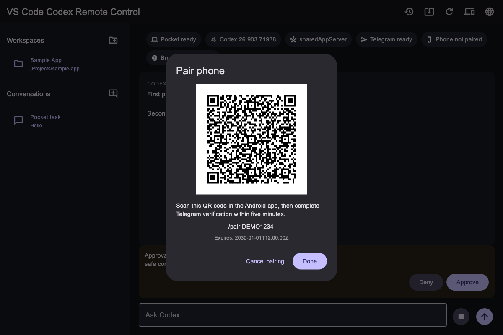
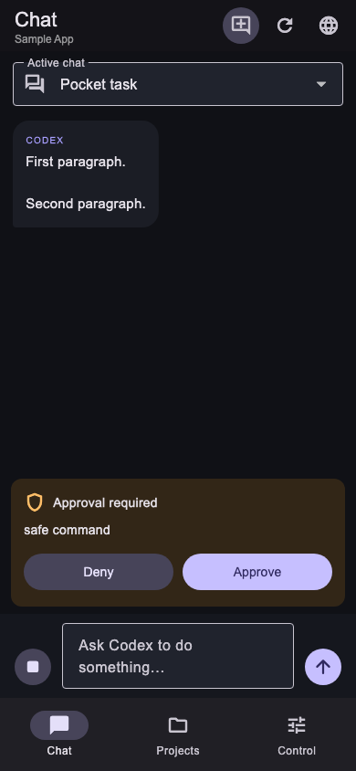
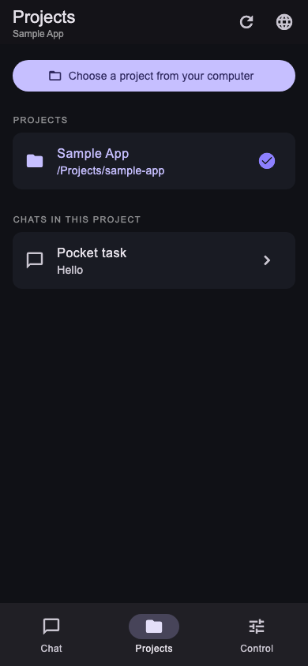
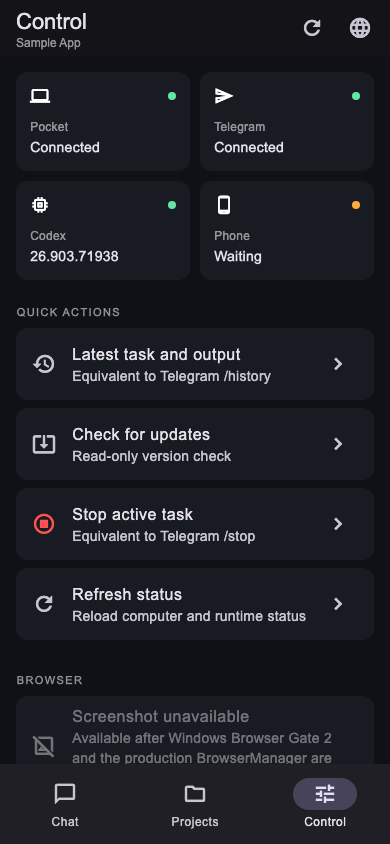

# VS Code Codex Remote Control

Control an isolated VS Code Codex session from a Mac, Telegram, or a paired Android phone. The desktop app starts the verified local runtime, keeps workspace and conversation routing exact, and exposes only typed operations such as sending a prompt, approving a request, or stopping a task.

> **Developer Preview:** This project is not affiliated with, endorsed by, or sponsored by Microsoft, OpenAI, Telegram, or Cloudflare. VS Code, Codex, Telegram, and Cloudflare are trademarks or services of their respective owners.

## Platform status

| Platform / feature | Status |
|---|---|
| macOS Apple Silicon | Preview |
| Android 10+ ARM64 | Preview |
| Windows | Gate 2 acceptance pending |
| iOS | Not supported yet |
| Browser screenshot / URL | Not available yet |

The current public prerelease is `v1.2.1-preview.1`. The interface supports English and Turkish. Its macOS DMG is ad-hoc signed and not notarized. Its Android APK is debug-signed; moving to a production signing key can require reinstalling the app. Background push notifications are unavailable unless a Firebase production configuration is supplied.

## What it does

- Starts an isolated, pinned VS Code and Codex extension without modifying daily VS Code or global extensions.
- Uses one authenticated App Server shared by the desktop UI, Telegram, and isolated workspaces.
- Opens or reuses workspaces and prevents duplicate runtimes.
- Selects existing conversations or starts a new one with a supported model and reasoning level.
- Preserves live-output paragraphs, lists, code, continuation messages, and late-join snapshots.
- Handles exact, single-use Approve/Deny actions and Stop.
- Pairs one Android phone by a five-minute, single-use QR code and Telegram identity proof.
- Uses an end-to-end encrypted mobile channel. The preview relay cannot read prompts, output, workspace paths, approvals, or the Telegram bot token.

## Install the preview

Download the artifacts from [GitHub Releases](https://github.com/OnurCekis/VSCode-Codex-Remote-Control/releases) and verify them against `SHA256SUMS.txt`.

- macOS: follow the [English macOS guide](docs/macos-installation.md) or [Türkçe macOS rehberi](docs/macos-installation-tr.md).
- Android: follow the [English Android guide](docs/android-v1.md) or [Türkçe Android rehberi](docs/android-v1-tr.md).

The desktop app performs Telegram onboarding itself. End users do not need Terminal, Git, Node.js, Python, or pnpm.

## Preview

| Desktop QR pairing | Android conversation |
|---|---|
|  |  |

| Android projects | Android controls |
|---|---|
|  |  |

## Security model

- Desktop listeners are loopback-only and protected by high-entropy capabilities.
- Telegram accepts only the configured user's private chat.
- The bot token stays on the computer and is never included in a QR code or mobile payload.
- Android keys are stored with Android Keystore-backed secure storage.
- Mobile messages use X25519, HKDF-SHA256, and AES-256-GCM with direction and sequence validation.
- The hosted relay forwards live opaque frames only, keeps no task history, and does not queue commands while the computer is offline.
- Hash, identity, routing, or readiness mismatches fail closed.

Read [SECURITY.md](SECURITY.md), [PRIVACY.md](PRIVACY.md), and the [architecture overview](docs/architecture.md) before operating a public deployment.

## Build from source

Requirements:

- Apple Silicon macOS for the desktop bundle
- Node.js 24.x and pnpm 11.22.0
- Python 3
- Flutter/Dart versions compatible with `apps/codex_pocket_ui/pubspec.lock`
- JDK 17 and Android SDK for Android builds

```sh
pnpm install --frozen-lockfile
pnpm typecheck
pnpm test
python3 -m unittest discover -s tests -p 'test_*.py'

cd apps/codex_pocket_ui
flutter pub get
flutter analyze
flutter test
```

Build the macOS preview with `./scripts/build-macos-dmg.sh`. Build the Android preview with:

```sh
cd apps/codex_pocket_ui
flutter build apk --debug --target-platform android-arm64
```

The repository does not contain Firebase credentials, Android release keys, Telegram tokens, or Cloudflare secrets. See the [relay operations and self-hosting guide](docs/relay-operations.md).

## Repository layout

- `packages/codex-core`: workspace, conversation, task, approval, and live-output logic
- `packages/pocket-runtime`: pairing, secure channel, runtime control, and profile sync
- `apps/codex_pocket_ui`: macOS and Android Flutter UI
- `apps/pocket-ui-bridge`: typed local UI and mobile gateway
- `apps/telegram-bot`: private-chat Telegram adapter
- `apps/pocket-relay`: Cloudflare Worker + Durable Object opaque relay
- `apps/pocket-cli`: isolated VS Code/runtime host and `pocket-code`

## Contributing and support

Use GitHub Issues for reproducible bugs and feature-completion problems. Never post tokens, personal Telegram identifiers, workspace contents, or raw logs containing private data. Report vulnerabilities through GitHub private vulnerability reporting as described in [SECURITY.md](SECURITY.md).

## License

Copyright 2026 Onur Cekis. Licensed under the [Apache License 2.0](LICENSE). Third-party components and services retain their own licenses and terms; see [NOTICE](NOTICE) and [THIRD_PARTY_NOTICES.md](THIRD_PARTY_NOTICES.md).
